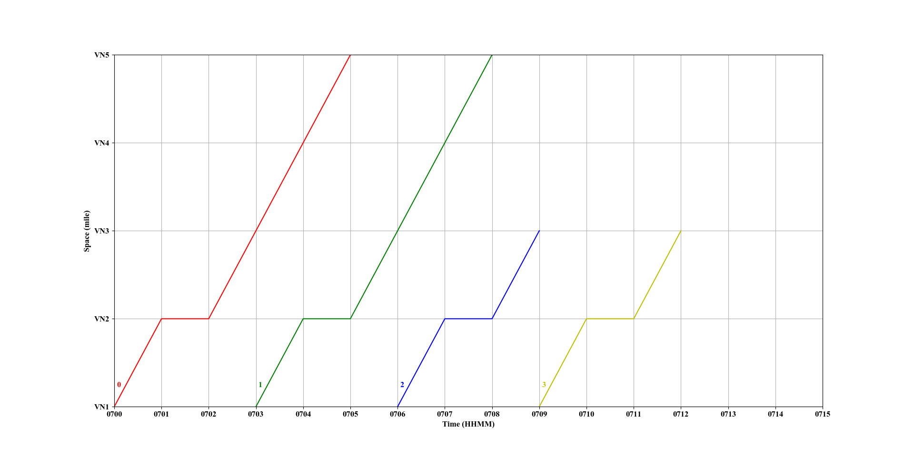
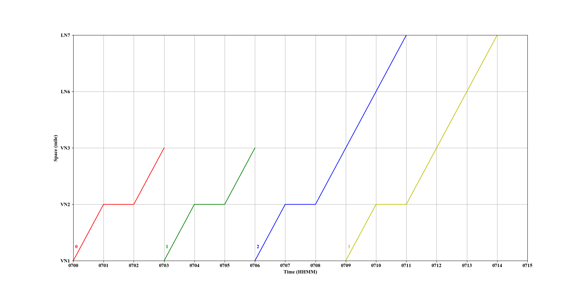

# space-time-diagram_gmns
Open-source space-time diagram visualization tool for General Modeling Network Specification (GMNS) 

###Collabrators: 

Mr. Yongxiang (John) Zhang, Ph.D. Candidate, at Southwest Jiaotong University

Dr. Xuesong (Simon) Zhou at Arizona State University

####Contact: Yongxiang (John) Zhang.
Email: bk20100249@my.swjtu.edu.cn

#Goals of space-time-diagram_gmns development
1. Read and parse the related data from the data files of NeXTA-GMNS (https://github.com/xzhou99/NeXTA-GMNS)
2. Provide a free and easy-to-use tool for visualizing the space-time trajectories of the agents.

#How to use

Latest Software Release 04-22-2020

Step 1: Install the Python 3.7 or a higher version of Python environment for running the code written in Python.

Step 2: Read the user guide in the "User guide for space-time-diagram_gmns.pdf" file, and prepare the input data files "node.csv", "road_link.csv" and "agent.csv" according to the specified data format in the "User guide for space-time-diagram_gmns.pdf". Sample files of the data files are also available at the "examples" folder.

Step 3: Run the python code on your computer and save the generated figure.

The following two figures show the space-time trajectories of the four agents on two physical paths 1 and 2, respectively. The readers can check the detailed information on the input data in the "examples" folder.

Space-time trajectories of the four agents on path 1:

Space-time trajectories of the four agents on path 2:

